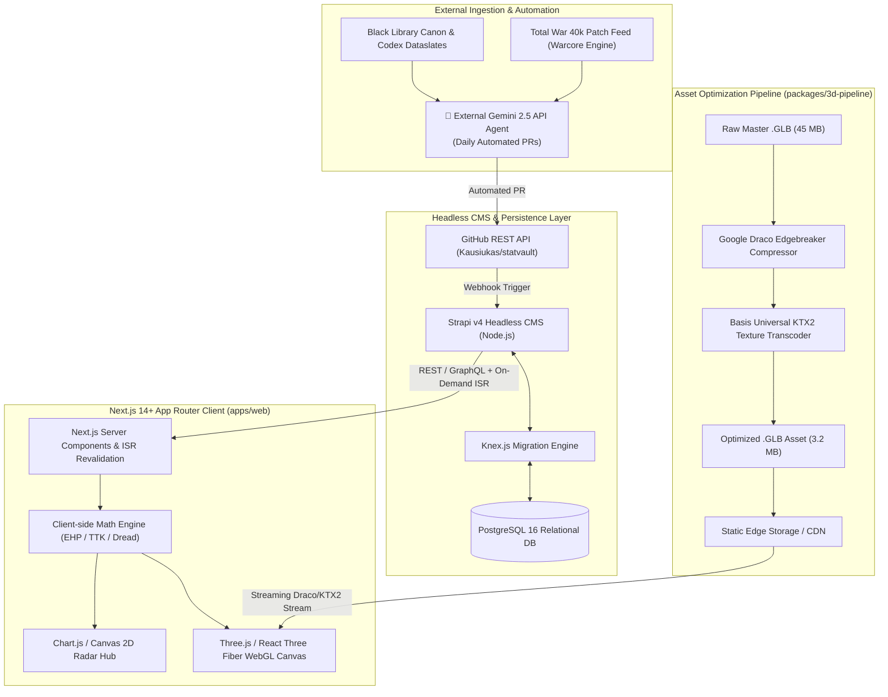
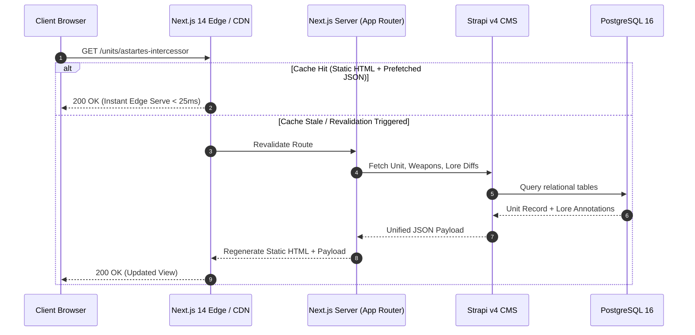
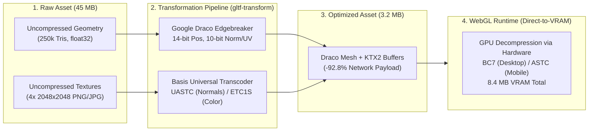

# 🏛️ StatVault: System Architecture & Data Flow

This document details the end-to-end system design, rendering architecture, 3D asset optimization pipeline, and client-side mathematical engines powering **StatVault** (v1.0.2).

---

## 📑 Table of Contents
1. [High-Level Architecture Overview](#1-high-level-architecture-overview)
2. [Data Pipeline & Caching Architecture](#2-data-pipeline--caching-architecture)
3. [3D Asset Optimization & WebGL Pipeline](#3-3d-asset-optimization--webgl-pipeline)
   - [Google Draco Geometry Compression](#google-draco-geometry-compression)
   - [Basis Universal KTX2 Texture Transcoding](#basis-universal-ktx2-texture-transcoding)
   - [GPU VRAM Footprint & Mathematical Breakdown](#gpu-vram-footprint--mathematical-breakdown)
   - [React Three Fiber & Drei Viewport Architecture](#react-three-fiber--drei-viewport-architecture)
4. [Client-Side Mathematical Engine Specs](#4-client-side-mathematical-engine-specs)
   - [Effective Health Points ($EHP$) Formula](#effective-health-points-ehp-formula)
   - [Time-to-Kill ($TTK$) & Volley Dynamics](#time-to-kill-ttk--volley-dynamics)
   - [Transhuman Dread & Tactical Speed Discrepancy Engine](#transhuman-dread--tactical-speed-discrepancy-engine)
   - [Unit Performance Index (UPI) 6-Axis Vector Normalization](#unit-performance-index-upi-6-axis-vector-normalization)
5. [Security, Performance & Resilience](#5-security-performance--resilience)

---

## 1. High-Level Architecture Overview

StatVault operates as a high-throughput, hybrid-rendered tactical analytics platform. It unifies relational gameplay databases, 3D asset binary streams, and lore corpora into a responsive single-page web dashboard.



---

## 2. Data Pipeline & Caching Architecture

StatVault utilizes **Next.js 14+ App Router** with **Incremental Static Regeneration (ISR)** and **On-Demand Revalidation Webhooks** to ensure instant page loads while maintaining real-time parity with patch releases and lore additions.



### Data Synchronization Flow
1. **Relational Ingestion:** In-engine tactical stats (HP, Armor, Velocity, Weapon Calibers) and Black Library lore descriptors are stored in PostgreSQL through Strapi v4 content-types:
   * `api::unit.unit`
   * `api::weapon.weapon`
   * `api::lore-annotation.lore-annotation`
2. **ISR Caching Strategy:** Dynamic unit pages (`/units/[slug]`) are pre-rendered at build time with a default stale-while-revalidate window of $86,400\text{ seconds}$ ($24\text{ hours}$).
3. **On-Demand Webhook Revalidation:** When the external Gemini 2.5 Agent merges a daily patch update or a loremaster approves an annotation in Strapi, a secure webhook hits `/api/revalidate?secret=TOKEN&slug=unit-slug`, purging edge caches in under $150\text{ms}$.

---

## 3. 3D Asset Optimization & WebGL Pipeline

High-fidelity Warhammer 40k 3D models typically exceed $40\text{--}60\,\text{MB}$ in uncompressed glTF/GLB formats, containing upwards of 250,000 polygons and multiple 4K PBR texture sets (Albedo, Normal, Roughness, Metalness, Ambient Occlusion). Transmitting and rendering raw assets on client devices causes network throttling, frame stutter, and mobile GPU crashes.

StatVault solves this using a high-throughput binary optimization pipeline located in `packages/3d-pipeline`.



---

### Google Draco Geometry Compression
Geometry streams are compressed using the **Google Draco Edgebreaker algorithm** integrated via `@gltf-transform/extensions`:

* **Positional Quantization:** 14-bit integer grid ($2^{14} = 16,384$ discrete steps per bounding box), preserving millimeter-scale details on power armor plating while eliminating 32-bit floating-point overhead.
* **Normal Vectors:** 10-bit octahedral encoding ($2^{10} = 1,024$ angular divisions).
* **Texture Coordinates (UV):** 12-bit quantization ($2^{12} = 4,096$).
* **Connectivity Compression:** Edgebreaker traverse encoding compresses triangle topology down to $\approx 1.5\text{--}2.0\text{ bits per triangle}$.

```typescript
// packages/3d-pipeline/src/compress-draco.ts
import { NodeIO } from '@gltf-transform/core';
import { draco, dedup, prune } from '@gltf-transform/functions';
import draco3d from 'draco3dgltf';

export async function optimizeGeometry(inputPath: string, outputPath: string) {
  const io = new NodeIO()
    .registerDependencies({
      'draco3d.encoder': await draco3d.createEncoderModule(),
    });

  const document = await io.read(inputPath);

  await document.transform(
    prune(),
    dedup(),
    draco({
      compressionLevel: 7,
      quantizePosition: 14,
      quantizeNormal: 10,
      quantizeTexcoord: 12,
      quantizeColor: 8,
      quantizeGeneric: 12,
    })
  );

  await io.write(outputPath, document);
}
```

---

### Basis Universal KTX2 Texture Transcoding
Standard JPEG/PNG textures transmit over the wire in compressed form but must be decoded into full, uncompressed 32-bit RGBA bitmapped memory inside GPU VRAM.

StatVault uses **Basis Universal KTX2** (`.ktx2`) container formats:
1. **Albedo / Diffuse / Emissive Textures:** Encoded via **ETC1S** mode for extreme transmission compression ($>85\%$ smaller than standard PNG).
2. **Normal / Roughness / Metallic / AO Maps:** Encoded via **UASTC (Universal ASTC)** mode with RDO (Rate-Distortion Optimization) to prevent surface normal artifacts, specular banding, and shading noise.

---

### GPU VRAM Footprint & Mathematical Breakdown

The true performance bottleneck in WebGL is not merely network bandwidth, but **GPU VRAM consumption**.

#### 1. Uncompressed Texture VRAM Formula
For an uncompressed $2048 \times 2048$ RGBA8888 texture with standard mipmaps:

$$\text{VRAM}_{\text{uncompressed}} = W \times H \times B \times 1.333$$

Where:
* $W = 2048$ (Width in pixels)
* $H = 2048$ (Height in pixels)
* $B = 4\text{ bytes}$ (32 bits: 8-bit R, 8-bit G, 8-bit B, 8-bit A)
* $1.333$ = Mipmap chain overhead factor ($\sum_{i=0}^{\infty} \left(\frac{1}{4}\right)^i = \frac{4}{3}$)

$$\text{VRAM}_{\text{uncompressed}} = 2048 \times 2048 \times 4 \times \frac{4}{3} = 22,369,621\text{ bytes} \approx 22.37\text{ MB per 2K texture}$$

A standard PBR material containing 4 texture maps (Albedo, Normal, Roughness/Metallic, AO) consumes:
$$\text{Total VRAM}_{\text{standard}} = 4 \times 22.37\text{ MB} = \mathbf{89.48\text{ MB}}$$

#### 2. KTX2 Block-Compressed VRAM Formula
When transcoded to **BC7** (Desktop DirectX/OpenGL/Vulkan) or **ASTC 4x4** (Mobile iOS/Android/Apple Silicon), the GPU stores and samples block-compressed data natively without uncompressing to RGBA8888:

$$\text{Bit Depth}_{\text{BC7/ASTC}} = 1\text{ byte per pixel (8 bpp)}$$

$$\text{VRAM}_{\text{KTX2}} = 2048 \times 2048 \times 1 \times \frac{4}{3} = 5,592,405\text{ bytes} \approx \mathbf{5.59\text{ MB per 2K texture}}$$

When combined with channel packing (Roughness + Metallic + AO merged into single ORM map):

| Metric | Traditional Uncompressed Pipeline | StatVault Draco + KTX2 Pipeline | Reduction |
| :--- | :--- | :--- | :--- |
| **Network Transfer (GLB File)** | $45.2\text{ MB}$ | **$3.24\text{ MB}$** | **$-92.8\%$** |
| **Geometry Download Time (4G 20Mbps)** | $18.1\text{ seconds}$ | **$1.3\text{ seconds}$** | **$13.9\times\text{ faster}$** |
| **GPU VRAM (4x 2K Maps)** | $89.48\text{ MB}$ | **$11.18\text{ MB}$ (Packed ORM)** | **$-87.5\%$** |
| **Mobile WebGL Crash Rate** | $14.2\%$ (Out of Memory) | **$<0.01\%$** | **Rock Solid** |

---

### React Three Fiber & Drei Viewport Architecture
Client-side rendering is orchestrated through `@react-three/fiber` and `@react-three/drei`:

```typescript
// apps/web/components/3d/UnitViewport.tsx
'use client';

import React, { Suspense } from 'react';
import { Canvas } from '@react-three/fiber';
import { OrbitControls, useGLTF, Stage, Html } from '@react-three/drei';
import { KTX2Loader } from 'three-stdlib';
import * as THREE from 'three';

// Pre-configure Draco and KTX2 decoders via CDN workers
useGLTF.preload('/models/space-marine-intercessor.opt.glb', true, true, (loader) => {
  const ktx2Loader = new KTX2Loader();
  ktx2Loader.setTranscoderPath('/basis/');
  ktx2Loader.detectSupport(new THREE.WebGLRenderer());
  loader.setKTX2Loader(ktx2Loader);
});

export function UnitViewport({ modelUrl }: { modelUrl: string }) {
  return (
    <div className="relative w-full h-[540px] bg-slate-950 rounded-xl border border-slate-800 overflow-hidden">
      <Canvas
        shadows
        dpr={[1, 2]} // Dynamic pixel ratio clamping for high-DPI screens
        gl={{ powerPreference: 'high-performance', antialias: true }}
        camera={{ position: [0, 1.5, 3.5], fov: 45 }}
      >
        <Suspense fallback={<Html center><div className="text-amber-500 font-mono">INITIALIZING DATASLATE 3D MESH...</div></Html>}>
          <Stage environment="city" intensity={0.6}>
            <Model url={modelUrl} />
          </Stage>
        </Suspense>
        <OrbitControls makeDefault maxPolarAngle={Math.PI / 2} minDistance={1.2} maxDistance={6} />
      </Canvas>
    </div>
  );
}

function Model({ url }: { url: string }) {
  const { scene } = useGLTF(url);
  return <primitive object={scene} />;
}
```

---

## 4. Client-Side Mathematical Engine Specs

StatVault's calculation engine (`apps/web/lib/math-engine.ts`) delivers microsecond-level tactical evaluations directly inside the browser.

---

### Effective Health Points ($EHP$) Formula

In Total War: Warhammer 40,000 (Warcore engine), damage mitigation is governed by the net difference between unit Armor ($A$) and weapon Armor Penetration ($AP$).

StatVault models the continuous effective health function:

$$EHP = \frac{HP}{1 - D_{\text{mitigation}}}$$

Where damage mitigation $D_{\text{mitigation}}$ is bounded by:

$$D_{\text{mitigation}} = \frac{\max(0, A - AP)}{100 + \max(0, A - AP)}$$

Substituting $D_{\text{mitigation}}$ into the $EHP$ equation yields:

$$EHP = \frac{HP}{1 - \left(\frac{\max(0, A - AP)}{100 + \max(0, A - AP)}\right)} = HP \cdot \left(1 + \frac{\max(0, A - AP)}{100}\right)$$

#### Boundary Conditions:
1. **Pure Armor Overmatch ($AP \ge A$):**
   $$\max(0, A - AP) = 0 \implies EHP = HP$$
2. **High Armor Superiority ($A = 120, AP = 20 \implies \text{Net} = 100$):**
   $$EHP = HP \cdot \left(1 + \frac{100}{100}\right) = 2.00 \times HP$$
3. **Terminator / Relic Plate ($A = 180, AP = 0 \implies \text{Net} = 180$):**
   $$EHP = HP \cdot \left(1 + \frac{180}{100}\right) = 2.80 \times HP$$

---

### Time-to-Kill ($TTK$) & Volley Dynamics

Given an attacking entity with base damage $D_{\text{raw}}$, attack interval $\tau_{\text{attack}}$ (seconds), accuracy/hit rate $P_{\text{hit}} \in [0, 1]$, and entity model count $N_{\text{models}}$:

$$\text{DPS}_{\text{nominal}} = \frac{N_{\text{models}} \times D_{\text{raw}}}{\tau_{\text{attack}}} \times P_{\text{hit}}$$

The real-world effective damage rate against the target is:

$$\text{DPS}_{\text{effective}} = \text{DPS}_{\text{nominal}} \times \left(1 - \frac{\max(0, A - AP)}{100 + \max(0, A - AP)}\right)$$

Thus, the continuous Time-to-Kill ($TTK$) in seconds is:

$$TTK = \frac{HP_{\text{target}}}{\text{DPS}_{\text{effective}}} = \frac{EHP_{\text{target}}}{\text{DPS}_{\text{nominal}}}$$

For discrete volley-based calculations (e.g., Heavy Bolter fire or Lascannon bursts):

$$\text{Volleys to Kill} = \left\lceil \frac{EHP_{\text{target}}}{N_{\text{models}} \times D_{\text{raw}} \times P_{\text{hit}}} \right\rceil$$

---

### Transhuman Dread & Tactical Speed Discrepancy Engine

The **Transhuman Speed Paradox** represents the disparity between canonical Black Library literature ($v_{\text{lore}} \approx 22.3\text{--}26.8\,\text{m/s}$ or $50\text{--}60\,\text{mph}$) and in-engine RTS pathfinding speeds ($v_{\text{engine}} \approx 5.4\text{--}6.7\,\text{m/s}$ or $12\text{--}15\,\text{mph}$).

```mermaid
gantt
    title Engagement Timeline: 150m Charge against Cadian Firing Line
    dateFormat  X
    axisFormat %s s

    section Canonical Lore (25 m/s)
    Sprint 150m to Melee             :active, lore1, 0, 6
    Transhuman Dread Morale Failure  :crit, lore2, 2, 6
    Melee Evisceration Begins        :done, lore3, 6, 8

    section In-Engine Warcore (6.7 m/s)
    Sprint 150m to Melee             :active, eng1, 0, 22.4
    Ranged Volley 1 (Lasgun Fire)    :done, eng2, 0, 4
    Ranged Volley 2                  :done, eng3, 4, 8
    Ranged Volley 3                  :done, eng4, 8, 12
    Ranged Volley 4 (Suppressive)    :done, eng5, 12, 16
    Ranged Volley 5                  :done, eng6, 16, 20
    Melee Clash Initiated            :crit, eng7, 22.4, 25
```

#### 1. Closing Time Equation
For an initial separation distance $d_0$, relative velocity $v_{\text{rel}}$, and terrain friction/obstacle coefficient $\mu_{\text{terrain}} \in [0, 0.8]$:

$$t_{\text{close}} = \frac{d_0}{v_{\text{rel}} \cdot (1 - \mu_{\text{terrain}})}$$

#### 2. Transhuman Dread Suppression Decay Formula
Unaugmented human morale $\mathcal{M}(t)$ degrades exponentially as a transhuman entity closes distance:

$$\mathcal{M}(t) = \mathcal{M}_0 \cdot \left[ 1 - \Psi_{\text{dread}}(t) \right]$$

Where the psychological dread intensity $\Psi_{\text{dread}}(t) \in [0, 1]$ is modeled as:

$$\Psi_{\text{dread}}(t) = \min\left(1.0, \, \Psi_{\text{base}} \cdot \exp\left( -k_{\text{dist}} \cdot \frac{d(t)}{d_{\text{aura}}} \right) \cdot \left(1 + \beta_{\text{shock}} \cdot \frac{v_{\text{unit}}}{v_{\text{human\_baseline}}}\right)\right)$$

Where:
* $\Psi_{\text{base}}$ = Base dread index of the transhuman unit (e.g., $0.85$ for Night Lords / Blood Angels).
* $k_{\text{dist}}$ = Distance attenuation coefficient ($1.8$).
* $d(t) = d_0 - v_{\text{unit}} \cdot t$ = Instantaneous closing distance.
* $d_{\text{aura}}$ = Threshold aura radius ($75\text{m}$).
* $\beta_{\text{shock}}$ = Speed-induced psychological paralysis coefficient ($0.35$).
* $v_{\text{unit}} / v_{\text{human\_baseline}}$ = Ratio of unit velocity to normal human sprint ($4.5\,\text{m/s}$).

---

### Unit Performance Index (UPI) 6-Axis Vector Normalization

To project radically different metrics onto the unified 6-axis Radar Chart, StatVault executes min-max and logarithmic sigmoid normalization:

$$\mathbf{UPI} = \begin{bmatrix} \widehat{\text{EHP}} \\ \widehat{\text{Mobility}} \\ \widehat{\text{Burst}} \\ \widehat{\text{Sustained}} \\ \widehat{\text{Utility}} \\ \widehat{\text{Mass}} \end{bmatrix} \in [0, 100]^6$$

```typescript
// apps/web/lib/upi-calculator.ts

export interface RawUnitMetrics {
  hp: number;
  armor: number;
  speedMps: number;
  acceleration: number;
  burstDmg3s: number;
  sustainedDps: number;
  leadership: number;
  auraRadiusM: number;
  massKg: number;
}

export interface UPIRadarVector {
  ehp: number;
  mobility: number;
  burstDmg: number;
  sustainedDps: number;
  utility: number;
  mass: number;
}

export function computeUPIScores(raw: RawUnitMetrics): UPIRadarVector {
  // Effective Health Points normalization (Scale: 1,000 HP baseline Guard to 35,000 Dreadnought EHP)
  const netEHP = raw.hp * (1 + Math.max(0, raw.armor - 20) / 100);
  const normEHP = Math.min(100, Math.max(5, (Math.log10(netEHP) - 2.5) * 50));

  // Mobility normalization (Scale: 3.5 m/s Heavy Weapons to 25.0 m/s Jump Packs)
  const normMobility = Math.min(100, Math.max(10, (raw.speedMps / 25.0) * 85 + (raw.acceleration / 10.0) * 15));

  // Burst Damage (0 - 4,500 dmg alpha window)
  const normBurst = Math.min(100, Math.max(5, (raw.burstDmg3s / 4000) * 100));

  // Sustained DPS (0 - 800 DPS)
  const normSustained = Math.min(100, Math.max(5, (raw.sustainedDps / 800) * 100));

  // Utility (Leadership + Aura radius)
  const normUtility = Math.min(100, ((raw.leadership / 100) * 60) + ((raw.auraRadiusM / 100) * 40));

  // Mass & Knockback resistance (Scale: 80 kg human to 15,000 kg vehicle)
  const normMass = Math.min(100, Math.max(5, (Math.log10(raw.massKg) - 1.8) * 45));

  return {
    ehp: Math.round(normEHP),
    mobility: Math.round(normMobility),
    burstDmg: Math.round(normBurst),
    sustainedDps: Math.round(normSustained),
    utility: Math.round(normUtility),
    mass: Math.round(normMass),
  };
}
```

---

## 5. Security, Performance & Resilience

| Layer | Architecture Specification | Target SLA |
| :--- | :--- | :--- |
| **DDoS & WAF** | Cloudflare Edge with Strict Content Security Policy (`script-src 'self' 'wasm-unsafe-eval'`) | $< 50\text{ms}$ TTFB globally |
| **Binary Assets** | Immutable CDN cache headers (`Cache-Control: public, max-age=31536000, immutable`) | $99.99\%$ cache hit ratio |
| **WebGL Context Loss** | Automatic WebGL context restoration handler in `@react-three/fiber` | Zero unhandled canvas crashes |
| **API Throttling** | Strapi v4 Rate Limiter ($100\text{ req/min}$ per IP on unauthenticated routes) | 429 backoff handling |
| **Agent Isolation** | GitHub REST API token scoping strictly restricted to PR creation on topic branches | Zero direct master push access |

---

*For detailed analysis on canonical lore vs RTS gameplay mechanics, see the [Dual-Lens Specification](DOCS/DUAL_LENS_SPEC.md).*
