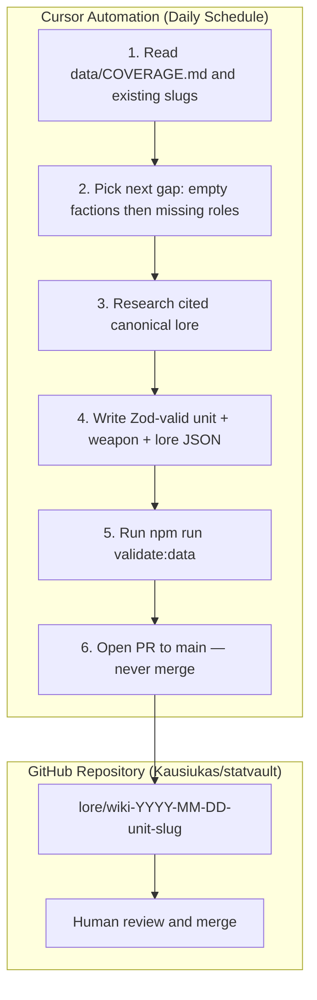

# 🤝 Contributing to StatVault & Agent Guidelines

Thank you for your interest in contributing to **StatVault**—the interactive source-of-truth database for Total War: Warhammer 40,000 (Warcore engine) units, 3D asset pipelines, and canonical lore dataslates.

StatVault is maintained as a collaborative hybrid ecosystem supported by **human developers, competitive RTS tacticians, Warhammer 40k loremasters, and autonomous AI agents**.

---

## 📑 Table of Contents
1. [Code of Conduct](#1-code-of-conduct)
2. [Daily Wiki Build-Up Agent (Cursor Automation)](#2-daily-wiki-build-up-agent-cursor-automation)
3. [Content & Data Schema Specifications](#3-content--data-schema-specifications)
   - [Unit Profile Schema](#unit-profile-schema)
   - [Weapon Profile Schema](#weapon-profile-schema)
   - [Lore Annotation Schema](#lore-annotation-schema)
4. [Git Commit & Branch Conventions](#4-git-commit--branch-conventions)
5. [Local Development & PR Lifecycle](#5-local-development--pr-lifecycle)

---

## 1. Code of Conduct

All contributors—both human and automated—are expected to uphold respectful, constructive, and evidence-backed discourse. Lore assertions must cite canonical sources (Black Library publications, Games Workshop Imperial Armor volumes, or Tabletop Rulebooks). In-engine tactical values must correlate with extracted Warcore data tables.

---

## 2. Daily Wiki Build-Up Agent (Cursor Automation)

StatVault runs a **daily Cursor Automation** that grows the lore-grounded dataslate corpus in `data/`. The agent researches one Warhammer 40k topic per run and opens a reviewable pull request — it never merges.



### Agent skill

The full protocol lives in [`.cursor/skills/statvault-wiki-build/SKILL.md`](.cursor/skills/statvault-wiki-build/SKILL.md). Key rules:

1. **Lore is authoritative.** Every lore stat must cite a real source (Black Library, Codex, Imperial Armor). Paraphrase only.
2. **Engine stats are Dual-Lens estimates** until official Warcore extracts exist. Derive from lore via compression ratios in `DOCS/DUAL_LENS_SPEC.md`.
3. **One cluster per run:** 1 unit + 1 primary weapon + 1 lore annotation.
4. **Coverage tracking:** Read and update `data/COVERAGE.md` to avoid duplicates.
5. **Schema validation:** Run `npm run validate:data` before opening any PR.

### Branch naming

```
lore/wiki-YYYY-MM-DD-<unit-slug>
lore/<unit-or-faction-slug>          # manual lore submissions
```

### Automated PR body must include

* Summary of added unit, weapon, and lore annotation slugs
* Full bibliographic citations (Author, Title, Year, Chapter/Page)
* Dual-Lens estimate disclaimer for all `engineStats` / `engineDamage` values
* `npm run validate:data` pass/fail status
* Open questions flagged for human review

### Coverage index

See [`data/COVERAGE.md`](data/COVERAGE.md) for the current backlog, faction gaps, and suggested queue.

---

## 3. Content & Data Schema Specifications

All additions to unit databases, weapon armories, and lore annotations must strictly conform to our TypeScript/Zod schemas.

---

### Unit Profile Schema
Located at `packages/schemas/unit.schema.ts`:

```typescript
import { z } from 'zod';

export const UnitProfileSchema = z.object({
  id: z.string().uuid(),
  slug: z.string().regex(/^[a-z0-9-]+$/),
  name: z.string().min(2).max(100),
  faction: z.enum([
    'adeptus_astartes',
    'astra_militarum',
    'chaos_space_marines',
    'orks',
    'aeldari',
    'necrons',
    'tyranids',
    'tau_empire',
  ]),
  role: z.enum(['shock_infantry', 'line_infantry', 'heavy_support', 'fast_attack', 'monstrous_creature', 'vehicle', 'lord_of_war']),
  
  // In-Engine Tactical RTS Balancing (Warcore Engine)
  engineStats: z.object({
    hitPoints: z.number().int().positive(),
    modelCount: z.number().int().positive(),
    armor: z.number().min(0).max(300),
    speedMps: z.number().positive(),
    chargeSpeedMps: z.number().positive(),
    acceleration: z.number().positive(),
    massKgPerModel: z.number().positive(),
    leadership: z.number().min(0).max(120),
    baseCostPoints: z.number().int().positive(),
    collisionRadiusM: z.number().positive(),
  }),

  // Canonical Lore Specifications (Black Library Canon)
  loreStats: z.object({
    reactionTimeMs: z.number().positive(),
    sprintSpeedMps: z.number().positive(),
    sprintSpeedMph: z.number().positive(),
    dreadAuraRadiusM: z.number().min(0),
    dreadShockFactor: z.number().min(0).max(1.0),
    armorComposition: z.string(),
    armorEquivalentRHAmm: z.number().positive(),
    combatStaminaHours: z.union([z.number().positive(), z.literal('infinite')]),
    citation: z.string(),
  }),

  // 3D Optimized Asset References
  asset3d: z.object({
    optimizedGlbPath: z.string().startsWith('/models/'),
    dracoCompressionRatio: z.number().min(0).max(1.0),
    vramFootprintMb: z.number().positive(),
    polyCount: z.number().int().positive(),
  }),
});

export type UnitProfile = z.infer<typeof UnitProfileSchema>;
```

#### Example Unit JSON Payload:
```json
{
  "id": "7b8f9e12-4c23-4f9e-918d-6a345b123456",
  "slug": "space-marine-intercessor-mkx",
  "name": "Intercessor (Mk.X Tacticus)",
  "faction": "adeptus_astartes",
  "role": "shock_infantry",
  "engineStats": {
    "hitPoints": 1600,
    "modelCount": 8,
    "armor": 90,
    "speedMps": 5.8,
    "chargeSpeedMps": 7.4,
    "acceleration": 4.5,
    "massKgPerModel": 450,
    "leadership": 85,
    "baseCostPoints": 850,
    "collisionRadiusM": 0.85
  },
  "loreStats": {
    "reactionTimeMs": 2.4,
    "sprintSpeedMps": 24.5,
    "sprintSpeedMph": 54.8,
    "dreadAuraRadiusM": 75,
    "dreadShockFactor": 0.85,
    "armorComposition": "Bonded Ceramite-Adamantium Plating with Reflec-Polymer Sheath",
    "armorEquivalentRHAmm": 450,
    "combatStaminaHours": 72,
    "citation": "Codex: Space Marines (9th Ed), Guy Haley - Dark Imperium"
  },
  "asset3d": {
    "optimizedGlbPath": "/models/space-marine-intercessor.opt.glb",
    "dracoCompressionRatio": 0.928,
    "vramFootprintMb": 8.4,
    "polyCount": 24500
  }
}
```

---

### Weapon Profile Schema
Located at `packages/schemas/weapon.schema.ts`:

```typescript
import { z } from 'zod';

export const WeaponProfileSchema = z.object({
  id: z.string().uuid(),
  slug: z.string(),
  name: z.string(),
  type: z.enum(['ballistic_slug', 'energy_plasma', 'energy_las', 'explosive_missile', 'melee_power', 'melee_chain']),
  
  engineDamage: z.object({
    baseDamage: z.number().positive(),
    armorPenetration: z.number().min(0),
    attacksPerSecond: z.number().positive(),
    rangeMeters: z.number().positive(),
    accuracyPercent: z.number().min(0).max(100),
    projectileVelocityMps: z.number().positive(),
  }),

  loreDescriptor: z.object({
    caliber: z.string(),
    muzzleVelocityMps: z.number().positive(),
    effectiveRangeKm: z.number().positive(),
    explosiveYieldJoules: z.number().positive().optional(),
    loreEffectDescription: z.string(),
  }),
});
```

---

### Lore Annotation Schema
Located at `packages/schemas/lore-annotation.schema.ts`:

```typescript
import { z } from 'zod';

export const LoreAnnotationSchema = z.object({
  id: z.string().uuid(),
  unitSlug: z.string(),
  category: z.enum(['velocity_discrepancy', 'armor_durability', 'transhuman_dread', 'weapon_potency']),
  citation: z.object({
    title: z.string(),
    author: z.string(),
    publisher: z.string().default('Black Library'),
    year: z.number().int(),
    pageOrChapter: z.string(),
  }),
  excerpt: z.string().min(20).max(1200),
  discrepancyFactor: z.number().positive(),
  approvedByModerator: z.boolean().default(false),
});
```

---

## 4. Git Commit & Branch Conventions

StatVault enforces the **Conventional Commits 1.0.0** specification.

### Commit Types:
* `feat:` A new user-facing feature (e.g., new 3D viewport mode, EHP graph feature).
* `fix:` A bug fix in calculation formulas or rendering contexts.
* `lore:` Adding or updating canonical Warhammer 40k dataslate entries or citations.
* `perf:` Optimization of WebGL draw calls, Draco compression settings, or ISR caching.
* `docs:` Documentation improvements (`README`, `ARCHITECTURE`, etc.).
* `refactor:` Code refactoring without behavioral alterations.
* `test:` Adding unit tests for formulas or Zod schema validators.
* `chore:` Build dependencies, configs, or package upgrades.

### Commit Message Structure:
```
<type>(<scope>): <short summary in imperative present tense>

[optional multi-line body with tactical context]

[optional issue reference, e.g., Closes #42]
```

#### Examples:
```bash
# Feature commit
feat(calculators): add multi-unit volley TTK threshold simulator

# Lore addition commit
lore(astartes): add Godwyn-pattern bolter penetration citation from Rynn's World

# Performance fix commit
perf(3d-pipeline): tune Draco position quantization from 16 to 14 bits
```

### Branch Naming Conventions:
* Features: `feature/short-feature-name`
* Bug Fixes: `fix/short-bug-name`
* Lore Submissions: `lore/unit-or-faction-slug`
* Daily Wiki Agent: `lore/wiki-YYYY-MM-DD-<unit-slug>`

---

## 5. Local Development & PR Lifecycle

### 1. Verification Checklist Before Submitting a PR
Ensure all automated tests, schema validations, and linting checks pass:

```bash
# 1. Validate all data/units, data/weapons, and data/lore JSON against Zod schemas
npm run validate:data

# 2. Run all workspace TypeScript checks
npm run typecheck

# 3. Run unit tests for math engine and schemas
npm run test

# 4. Verify ESLint and Prettier compliance
npm run lint
npm run format:check

# 5. If modifying 3D models, validate glTF structure
npm run pipeline:validate --workspace=packages/3d-pipeline
```

### 2. Pull Request Submission
1. Push your branch to your fork or origin.
2. Open a Pull Request targeting the **`main`** branch on `Kausiukas/statvault`.
3. Fill out the PR template completely with verification steps.
4. Maintainers will review and merge upon CI approval.

---

*Thank you for helping build the premier open-access dataslate for Total War: Warhammer 40,000!*
