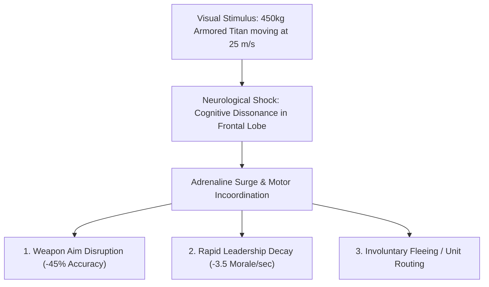

# ⚔️ StatVault Technical Dataslate: The Dual-Lens Analytical Framework

**Classification:** Level-4 Mechanicus Analytical Protocol / Imperial Tactica  
**Document ID:** `SPEC-DUAL-LENS-40K-WARCORE-v1.0.2`  
**Engine Reference:** Creative Assembly Warcore Engine (Total War: Warhammer 40,000)  
**Canon Reference:** Black Library Corpus & Imperial Armor Technical Volumes  

---

## 📑 Executive Summary

The **Dual-Lens Analytical Framework** is the foundational methodology of **StatVault**. It formalizes, measures, and visualizes the profound divergence between:

1. **⚙️ The In-Engine Tactical Lens:** Deterministic parameters engineered for competitive RTS balance, spatial pathfinding stability, and human reaction latency in the Creative Assembly Warcore engine.
2. **⚡ The Canonical Lore Lens:** The lore-accurate universe depicted in Black Library literature, where genetic engineering, cybernetics, and power armor yield transhuman capabilities far beyond mortal comprehension.

This document serves as the theoretical and empirical specification behind StatVault's calculators, radar indices, and simulation engines.

---

## 1. The Transhuman Speed Paradox

```
+-----------------------------------------------------------------------------------+
|                        THE TRANSHUMAN SPEED PARADOX                                |
|                                                                                   |
|  [CANONICAL LORE: 25.0 m/s (56 mph)]                                              |
|  ===============================================================> (2.0s closing)  |
|                                                                                   |
|  [WARCORE ENGINE: 6.0 m/s (13.4 mph)]                                             |
|  ===============> (8.3s closing)                                                  |
|                                                                                   |
|  Compression Ratio:  4.17x Speed Throttle                                         |
|  Tactical Cause:     Pathfinding Mesh Limits, Collision Grids & Human APM Latency |
+-----------------------------------------------------------------------------------+
```

### The Conflict of Dimensions
In Black Library canon (e.g., *Horus Heresy: False Gods*, Aaron Dembski-Bowden's *Night Lords*, Guy Haley's *Dark Imperium*), an Adeptus Astartes in Mark X Tacticus or Mark VII Aquila power armor sprints at sustained speeds between **$50\text{--}60\,\text{mph}$ ($22.3\text{--}26.8\,\text{m/s}$)** with burst capabilities exceeding **$70\,\text{mph}$ ($31.3\,\text{m/s}$)**. A Space Marine accelerates from a standstill to maximum velocity in under $0.4\text{ seconds}$ thanks to the myomer muscle bundles and artificial spinal interfaces of his armor.

However, in Total War: Warhammer 40,000 (Warcore engine), an Intercessor squad moves across terrain at **$5.4\text{--}6.7\,\text{m/s}$ ($12\text{--}15\,\text{mph}$)**.

### Why RTS Engines Compress Velocity ($4.17\times$ Factor)

$$\text{Compression Factor } \kappa = \frac{v_{\text{lore}}}{v_{\text{engine}}} = \frac{25.0\,\text{m/s}}{6.0\,\text{m/s}} \approx \mathbf{4.17\times}$$

This compression is an unavoidable mathematical consequence of real-time strategy constraints:

#### 1. Spatial Partitioning & Grid Collision Update Rates
The Warcore engine resolves unit physics across spatial partitioning grids (Uniform Spatial Grids / BVH trees) updating at a fixed simulation tick rate ($\Delta t = 20\text{ms}$ or $50\text{ Hz}$).
* If an 8-man Space Marine squad charged at $25\,\text{m/s}$, each model would traverse $0.5\text{ meters per tick}$.
* At that step size, fast-moving models would penetrate or tunnel through opposing infantry bounding boxes before the physics engine could compute contact normals, resulting in model clipping, broken formations, and physics destabilization.

#### 2. Human Reaction Time & APM Window
* Average human auditory/visual reaction time: $200\text{--}250\,\text{ms}$.
* Tactical decision-making and command execution time: $1,200\text{--}2,000\,\text{ms}$.
* At canonical lore speeds ($25\,\text{m/s}$), an Astartes squad emerging from fog of war at $100\text{m}$ distance closes to melee range in exactly **$4.0\text{ seconds}$**.
* This leaves an Astra Militarum commander virtually zero tactical agency to adjust firing arcs, activate defensive abilities (e.g., *Take Aim!*, *First Rank Fire, Second Rank Fire!*), or execute kiting maneuvers.
* Compressing movement speed to $6\,\text{m/s}$ extends the engagement window to **$16.7\text{ seconds}$**, restoring competitive micro-pacing.

#### 3. Weapon Range & Firing Line Compression
Tabletop and RTS maps operate on an abbreviated spatial scale. A Godwyn-pattern Bolter or Lasgun with an effective canonical range of $1,500\text{--}2,000\text{ meters}$ is compressed in-engine to $180\text{--}220\text{ meters}$. If infantry moved at uncompressed speeds against compressed firing ranges, ranged units would become completely obsolete.

---

## 2. Transhuman Dread Mechanism

In Warhammer 40,000 literature, **Transhuman Dread** is an acute, physiological terror response experienced by ordinary mortals when witnessing post-human warriors moving with impossible, supernatural speed.

> *"Transhuman dread is an instinctual terror that strikes unaugmented humans when they see a Space Marine moving at full speed. The human mind simply cannot reconcile an armored colossus the size of a battle-tank moving faster than an apex predator."*  
> — **Black Library Archive Ref: BL-CSM-40K**



### Mathematical Simulation of Transhuman Dread

StatVault models the psychological degradation field $\Psi_{\text{dread}}(t)$ as a function of target distance $d(t)$, unit velocity $v_{\text{unit}}$, and armor mass $M$:

$$\Psi_{\text{dread}}(t) = \min\left(1.0, \, \Psi_0 \cdot \exp\left( -k \cdot \frac{d(t)}{R_{\text{aura}}} \right) \cdot \left[ 1 + \alpha \cdot \left(\frac{v_{\text{unit}}}{v_{\text{human}}}\right) \cdot \left(\frac{M_{\text{unit}}}{M_{\text{human}}}\right)^{1/3} \right]\right)$$

Where:
* $\Psi_0 = 0.75$ (Baseline terror constant)
* $k = 1.65$ (Exponential distance decay constant)
* $R_{\text{aura}} = 75\text{m}$ (Effective radius of psychological influence)
* $v_{\text{human}} = 4.5\,\text{m/s}$, $M_{\text{human}} = 80\,\text{kg}$
* For an Intercessor ($v_{\text{lore}} = 24.5\,\text{m/s}$, $M = 450\,\text{kg}$):

$$\text{Scaling Multiplier} = 1 + 0.25 \cdot \left(\frac{24.5}{4.5}\right) \cdot \left(\frac{450}{80}\right)^{1/3} \approx 1 + 0.25 \cdot 5.44 \cdot 1.78 = \mathbf{3.42\times}$$

This explains why unaugmented infantry lines frequently collapse into rout before an Astartes charge even makes physical contact.

---

## 3. Comparative Unit Matrix: Lore vs. Engine

The table below contrasts 5 benchmark units across both operational lenses.

| Unit Entity | Lens Domain | Hit Points / Durability | Speed (m/s / mph) | Reaction Time / APM | Armor / Protection Profile | Base Weapon DPS & Range | Transhuman Dread Aura |
| :--- | :--- | :--- | :--- | :--- | :--- | :--- | :--- |
| **Adeptus Astartes**<br>*(Intercessor Mk.X)* | **In-Engine**<br><br>**Canon Lore** | 1,600 HP (8 models)<br><br>Immense (Dual Hearts, Larraman Cells) | 5.8 m/s (13.0 mph)<br><br>**24.5 m/s (54.8 mph)** | Standard RTS tick<br><br>**2.4 ms reflex arc** | 90 Armor Rating<br><br>450mm RHAe Ceramite-Adamantium | 38 DPS (Range: 180m)<br><br>.75 Cal High-Explosive Rocket Propelled | 0m (Passive Leadership Buff)<br><br>**75m Paralyzing Fear Aura** |
| **Astra Militarum**<br>*(Kasrkin Grenadier)* | **In-Engine**<br><br>**Canon Lore** | 1,120 HP (10 models)<br><br>Elite Human Peak Condition | 5.0 m/s (11.2 mph)<br><br>**7.5 m/s (16.8 mph)** | Standard RTS tick<br><br>160 ms human reflex | 60 Armor Rating<br><br>90mm RHAe Carapace Plate | 42 DPS (Range: 160m)<br><br>Hotshot High-Yield Focused Las-Beam | None<br><br>Immune to minor psychological terror |
| **Astra Militarum**<br>*(Cadian Shock Trooper)* | **In-Engine**<br><br>**Canon Lore** | 900 HP (12 models)<br><br>Standard Human Baseline | 4.8 m/s (10.7 mph)<br><br>**6.2 m/s (13.8 mph)** | Standard RTS tick<br><br>220 ms human reflex | 30 Armor Rating<br><br>35mm RHAe Flak Armor (Ablative) | 22 DPS (Range: 150m)<br><br>M36 Kantrael Lasgun (19 Megathule burst) | None (Susceptible)<br><br>**Morale failure within 3.5s of Astartes charge** |
| **Orks**<br>*(Ork Boy - Slugga/Choppa)* | **In-Engine**<br><br>**Canon Lore** | 1,920 HP (16 models)<br><br>Fungal Biology, Ignores Amputations | 5.2 m/s (11.6 mph)<br><br>**11.0 m/s (24.6 mph)** | Standard RTS tick<br><br>85 ms feral reaction | 25 Armor Rating<br><br>Improvised Scrap Iron & Thick Hide | 34 DPS (Melee Focused)<br><br>Monomolecular Serrated Cleaver | 0m (Waaagh! Morale Boost)<br><br>**Immune to Transhuman Dread (Excitement)** |
| **Chaos Space Marines**<br>*(Chaos Chosen)* | **In-Engine**<br><br>**Canon Lore** | 1,750 HP (8 models)<br><br>Millennia of Warp-Infused Resilience | 5.8 m/s (13.0 mph)<br><br>**26.0 m/s (58.2 mph)** | Standard RTS tick<br><br>**1.8 ms Warp-enhanced** | 95 Armor Rating<br><br>Warp-Forged Corrupted Ceramite | 48 DPS (Melee / Plasma)<br><br>Cursed Bolters, Daemon Blades | 0m (Terror Trait in-game)<br><br>**90m Aura of Cosmic Despair & Dread** |

---

## 4. Analytical Metrics & UPI Radar Normalization

To convert raw parameters into the 6-axis **Unit Performance Index (UPI)** radar chart, StatVault applies vector normalization across all factions:

```mermaid
radar-chart
    title "Intercessor: Engine (Blue) vs Lore Canon (Red)"
    axis EHP, Mobility, BurstDMG, SustainedDPS, Utility, Mass
    "In-Engine RTS": [65, 45, 55, 60, 50, 48]
    "Canonical Lore": [92, 95, 88, 85, 78, 82]
```

### Mathematical Formulations for Radar Axes

#### 1. Effective Health ($\widehat{\text{EHP}}$):
$$\widehat{\text{EHP}} = \text{clamp}\left(0, 100, \, \left(\log_{10}(EHP) - 2.5\right) \times 50\right)$$

#### 2. Mobility ($\widehat{\text{Mobility}}$):
$$\widehat{\text{Mobility}} = \text{clamp}\left(0, 100, \, \left(\frac{v_{\text{speed}}}{25.0}\right) \times 80 + \left(\frac{a_{\text{accel}}}{10.0}\right) \times 20\right)$$

#### 3. Burst Damage ($\widehat{\text{Burst}}$):
$$\widehat{\text{Burst}} = \text{clamp}\left(0, 100, \, \left(\frac{\text{Damage}_{3\text{s}}}{4000}\right) \times 100\right)$$

#### 4. Sustained DPS ($\widehat{\text{Sustained}}$):
$$\widehat{\text{Sustained}} = \text{clamp}\left(0, 100, \, \left(\frac{\text{DPS}_{\text{continuous}}}{800}\right) \times 100\right)$$

#### 5. Utility ($\widehat{\text{Utility}}$):
$$\widehat{\text{Utility}} = \text{clamp}\left(0, 100, \, \left(\frac{\text{Leadership}}{100}\right) \times 60 + \left(\frac{R_{\text{aura}}}{100}\right) \times 40\right)$$

#### 6. Mass & Impact Momentum ($\widehat{\text{Mass}}$):
$$\widehat{\text{Mass}} = \text{clamp}\left(0, 100, \, \left(\log_{10}(M_{\text{kg}}) - 1.8\right) \times 45\right)$$

---

## 5. Conclusion & The Modder's Dilemma

StatVault provides the quantitative bridge between these two universes. For competitive multiplayer players, the **Engine Lens** provides frame-perfect weapon timings, optimal counter-picks, and EHP break-even curves. For modders and immersion enthusiasts creating "Lore-Authentic Realism Overhauls," the **Lore Lens** provides exact targets for velocity curves, lethality multipliers, and psychological panic radiuses.

*The Omnissiah preserves all knowledge. Verify your calculations.*
