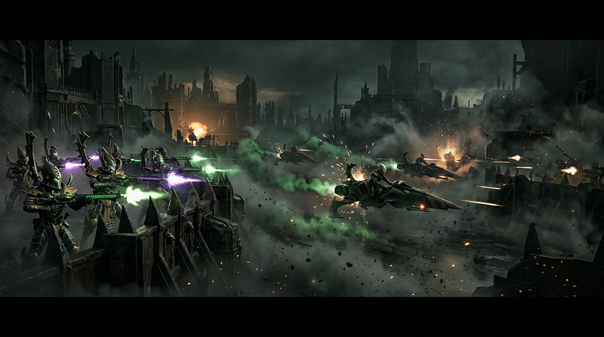
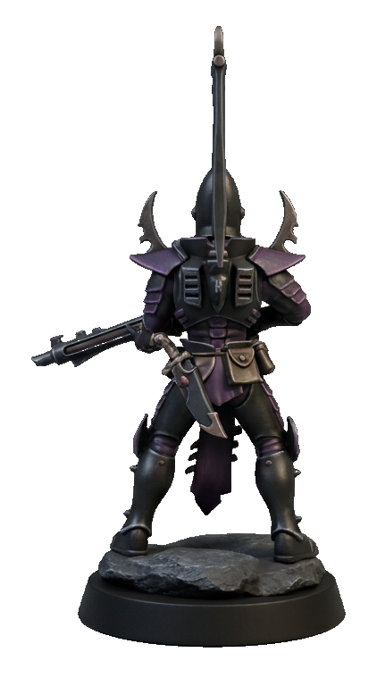
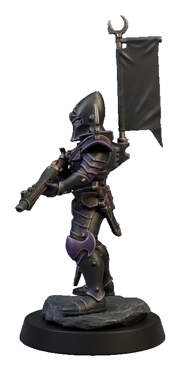
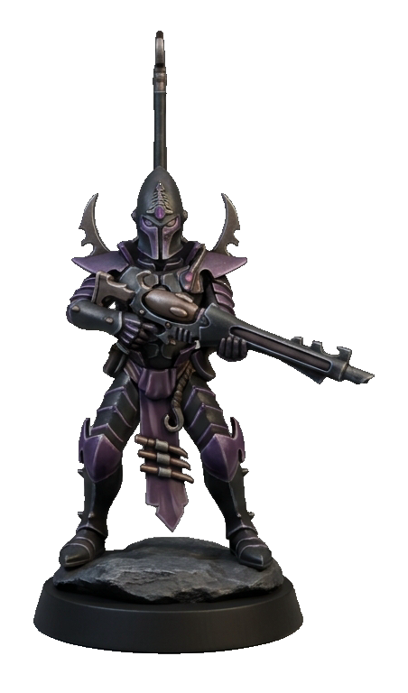
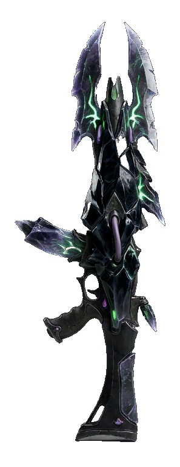
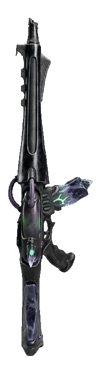
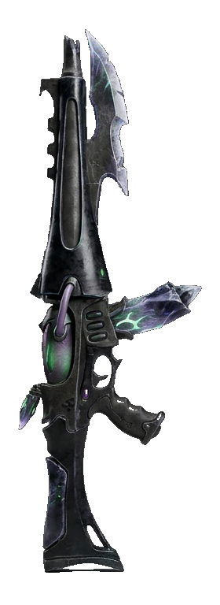
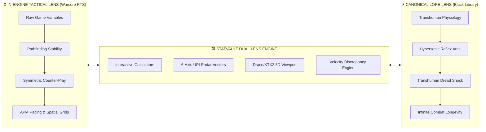

<div align="center">

# 🏛️ StatVault (v1.0.2)

### *The Interactive Source-of-Truth Database & Tactical Dataslate for Total War: Warhammer 40,000 (Warcore Engine)*

[-000000?style=for-the-badge&logo=nextdotjs&logoColor=white)](https://nextjs.org/)
[](https://docs.pmnd.rs/react-three-fiber)
[](https://tailwindcss.com/)
[](https://www.chartjs.org/)
[-2F2E8B?style=for-the-badge&logo=strapi&logoColor=white)](https://strapi.io/)
[](https://www.postgresql.org/)
[](https://www.khronos.org/gltf/)
[](https://github.com/Kausiukas/statvault)
[](https://opensource.org/licenses/MIT)

<br />

```
  ███████╗████████╗ █████╗ ████████╗██╗   ██╗ █████╗ ██╗   ██╗██╗  ████████╗
  ██╔════╝╚══██╔══╝██╔══██╗╚══██╔══╝██║   ██║██╔══██╗██║   ██║██║  ╚══██╔══╝
  ███████╗   ██║   ███████║   ██║   ██║   ██║███████║██║   ██║██║     ██║   
  ╚════██║   ██║   ██╔══██║   ██║   ╚██╗ ██╔╝██╔══██║██║   ██║██║     ██║   
  ███████║   ██║   ██║  ██║   ██║    ╚████╔╝ ██║  ██║╚██████╔╝███████╗██║   
  ╚══════╝   ╚═╝   ╚═╝  ╚═╝   ╚═╝     ╚═══╝  ╚═╝  ╚═╝ ╚═════╝ ╚══════╝╚═╝   
```

**[Launch Interactive Hub](statvault_interactive_hub.html)** • **[Explore Live Demo](https://statvault.warcore.dev)** • **[Read Architecture](ARCHITECTURE.md)** • **[Dual-Lens Framework](DOCS/DUAL_LENS_SPEC.md)** • **[Contributing Guide](CONTRIBUTING.md)**

</div>

---

<!-- FEATURED_HEADER_START -->
<div align="center">

## 🌟 Daily Featured Dataslate: Kabalite Warriors Syndicate
*Autonomous Ingestion Pipeline — Canonical Lore Research, Multi-View Asset Suite & Battlefield Concept Art*

<table>
  <tr>
    <td align="center">
      
      <br/>
      <sub><b>⚔️ Tactical Reconnaissance Visual:</b> <i>Kabalite Warriors Syndicate deployed in active battlefield engagement</i></sub>
    </td>
  </tr>
</table>

<table>
  <tr>
    <td width="38%" align="center" valign="middle">
      
      <br/>
      <sub><b>StatVault Asset:</b> Primary Tactical Profile</sub>
    </td>
    <td width="62%" valign="top">
      <h3><b>Kabalite Warriors Syndicate</b></h3>
      <p>
        
        
        
      </p>
      <p><b>📖 Tactical Analysis:</b><br/>
      <i>"High-speed venomous skirmishers. Poisoned splinter weapons bypass heavy organic toughness; extremely fragile under counter-battery fire."</i></p>
      <p><b>⚡ Dual-Lens Engine vs Lore Balance:</b><br/>
      • <b>Lore Armor Protection:</b> 70mm RHAe<br/>
      • <b>In-Engine Durability:</b> 880 HP (Armor Rating: 35)<br/>
      • <b>RTS Tactical Speed:</b> 12.3 mph (19.8 km/h)<br/>
      • <b>Primary Armament:</b> Drukhari Splinter Rifle (AP: 22, Base Dmg: 30)<br/>
      • <b>Lore Phenomenon:</b> Sadistic raiders of Commorragh. Incredibly swift and lethal, wielding splinter rifles that fire crystallised virulent neurotoxins that induc...</p>
    </td>
  </tr>
</table>

<table>
  <tr>
    <th colspan="3" align="center">🧬 Unit Orthographic Multi-View (3 Angles)</th>
  </tr>
  <tr>
    <td width="33%" align="center"><sub><b>Front Profile (0°)</b></sub><br/><br/><a href="assets/art/kabalite-warrior_multiview_0.png"></a></td>
    <td width="33%" align="center"><sub><b>Flank Profile (90°)</b></sub><br/><br/><a href="assets/art/kabalite-warrior_multiview_1.png"></a></td>
    <td width="33%" align="center"><sub><b>Dorsal Profile (180°)</b></sub><br/><br/><a href="assets/art/kabalite-warrior_multiview_2.png"></a></td>
  </tr>
</table>

<table>
  <tr>
    <th colspan="3" align="center">⚔️ Primary Armament Multi-View: Drukhari Splinter Rifle</th>
  </tr>
  <tr>
    <td width="33%" align="center"><sub><b>Lateral Aspect</b></sub><br/><br/><a href="assets/art/splinter-rifle_multiview_0.png"></a></td>
    <td width="33%" align="center"><sub><b>Dorsal Aspect</b></sub><br/><br/><a href="assets/art/splinter-rifle_multiview_1.png"></a></td>
    <td width="33%" align="center"><sub><b>Cutting/Barrel Aspect</b></sub><br/><br/><a href="assets/art/splinter-rifle_multiview_2.png"></a></td>
  </tr>
</table>

<p align="center">
  <a href="data/units/kabalite-warrior.json"><b>📄 Inspect Unit Dataslate (.json)</b></a> • <a href="data/weapons/splinter-rifle.json"><b>💥 Weapon Specs (.json)</b></a>
</p>

</div>

---
<!-- FEATURED_HEADER_END -->

## ⚡ Vision Statement & The Dual-Lens Perspective

**StatVault** is an open-access, high-performance web dashboard, 3D asset inspection terminal, and analytical source-of-truth database built specifically for strategy gamers, modders, competitive RTS tacticians, and Warhammer 40,000 lore enthusiasts.

At the heart of StatVault lies the **Dual-Lens Analytical Engine**—a framework that bridges the fundamental design tension between real-time strategy balance and authentic Grimdark science fiction:



1. **⚙️ In-Engine Tactical Balancing (Warcore Engine):** Raw RTS parameters engineered by Creative Assembly for mechanical game balance, deterministic collision meshes, pathfinding stability, unit mass interactions, and competitive micro-pacing (e.g., Space Marine tactical sprint speeds throttled to 12–15 mph / $5.4\text{--}6.7\,\text{m/s}$).
2. **⚡ Canonical Lore Authenticity (Black Library Canon):** The terrifying, uncompressed universe of 41st Millennium transhuman capability—where Adeptus Astartes sprint at 50–60 mph ($22.3\text{--}26.8\,\text{m/s}$), strike with nanosecond reaction times, project paralyzing **Transhuman Dread**, and wield relic weaponry capable of disintegrating armored infantry in microsecond bursts.

StatVault harmonizes these two lenses into a single unified dataslate equipped with interactive mathematical simulators, WebGL 3D model viewports, and automated patch diff trackers.

---

## 🚀 Core Interactive Features

### 1. 📊 Dual-Lens Unit Profiles & UPI Radar Hub
The **Unit Performance Index (UPI)** normalizes in-engine RTS parameters and lore specifications into a unified 6-axis vector radar chart powered by **Chart.js** and the Canvas API:
* **EHP (Effective Health Points):** Raw survivability against armor-penetrating ballistic profiles.
* **Mobility:** Traverse velocity, acceleration curves, jump-pack thrust vectors, and charge mass.
* **Burst DMG:** Alpha-strike potential within an opening 3-second engagement window.
* **Sustained DPS:** Long-term theoretical rate of fire modulated by reload, heat dissipation, and weapon cooldowns.
* **Utility:** Leadership auras, suppression radius, electronic warfare, and detachment buff multipliers.
* **Mass & Impact:** Physics engine momentum displacement, disruption weight, and knockback resistance.

```
          [EHP]
           /\
[Utility] /  \ [Mobility]
         |    |
[Sust.  \    / [Burst
  DPS]    \/     DMG]
        [Mass]
```

### 2. 🏃 Velocity & Transhuman Dread Discrepancy Analyzer
An interactive tactical speed compression simulator that contrasts in-engine pathfinding velocities with canonical Astartes bio-mechanics:
* **Tactical Speed Compression:** Visualizes why engine tick rates and spatial grids require a $4\times$ speed downscaling.
* **Closing Time Calculator:** Computes time-to-engage across varying battlefield distances ($50\text{m}\text{--}500\text{m}$) considering obstacle density ratings ($\mu_{\text{terrain}}$).
* **Transhuman Dread Aura Simulator:** Calculates psychological morale decay and aim disruption inflicted upon unaugmented mortals (e.g., Cadian Guardsmen, Chaos Cultists) as transhuman shock-infantry close distance.

### 3. 🧮 Combat Sandbox & EHP Calculator
StatVault provides a real-time damage mitigation engine executing the Warcore ballistic penetration formula:

$$EHP = \frac{HP}{1 - \left(\frac{\max(0, A - AP)}{100 + \max(0, A - AP)}\right)}$$

Where:
* $HP$ = Base Health Points of the unit entity.
* $A$ = Composite Armor Rating.
* $AP$ = Attacking Weapon Armor Piercing value.
* $\max(0, A - AP)$ = Effective Net Armor Value after penetration calculation.

The simulator models Time-to-Kill ($TTK$), volley survival thresholds, and overkill waste across varying caliber types (e.g., Godwyn-pattern .75 cal Bolter, Hotshot Lasgun, Ork Choppa, Plasma Overcharge).

### 4. 🎮 3D WebGL Asset & VRAM Memory Inspector
Powered by **Three.js**, **React Three Fiber (`@react-three/fiber`)**, and **`@react-three/drei`**:
* **High-Fidelity Model Viewport:** Interactive 360° inspection of unit meshes, weapon attachments, LOD switches, and wireframe topologies.
* **Draco Geometry Compression:** Real-time demonstration of mesh optimization reducing raw 45MB `.glb` master files to **3.2MB** ($-92.8\%$ transfer footprint) via 14-bit positional quantization.
* **Basis Universal KTX2 Texture Transcoding:** Demonstrates direct GPU VRAM block-compression (BC7 on desktop, ASTC on mobile) maintaining 2048x2048 PBR maps within 4MB VRAM footprint compared to uncompressed 16MB RGBA8888 buffers.

```
+-------------------------------------------------------------+
| 3D WebGL Viewport (React Three Fiber)                      |
|                                                             |
|   [ Space Marine Intercessor Mk.X Tacticus ]                |
|                                                             |
|   Mesh Compression:  Google Draco Edgebreaker (-92.8%)      |
|   Raw Geometry:      45.0 MB  ==>  Optimized: 3.2 MB        |
|   VRAM Textures:     KTX2 Basis Universal (BC7 / ASTC)      |
|   GPU Memory Load:   8.4 MB (vs Uncompressed 48.0 MB)       |
+-------------------------------------------------------------+
```

### 5. 🔄 Patch Diff Tracker & Community Lore Moderation Queue
* **Automated Patch Diffs:** Visual diffing of Total War 40k unit updates, point balance recalibrations, animation timings, and weapon spread modifications.
* **Community Lore Queue:** Strapi v4 headless CMS moderation workflow allowing verified loremasters to submit cited Black Library annotations, novel passages, and tabletop codex cross-references.

---

## 📂 Repository Monorepo Architecture

StatVault is structured as a modular TypeScript monorepo configured with Turborepo:

```
statvault/
├── apps/
│   ├── web/                        # Next.js 14+ (App Router) Frontend Application
│   │   ├── app/                    # App Router pages, layouts, and API route handlers
│   │   │   ├── units/              # Dynamic Unit Profile & Comparison routes
│   │   │   ├── sandbox/            # Combat Sandbox & EHP Calculator
│   │   │   ├── dread/              # Transhuman Dread & Velocity Simulator
│   │   │   └── api/                # Edge runtime proxy endpoints
│   │   ├── components/             # Reusable UI components
│   │   │   ├── 3d/                 # Three.js / R3F Canvas & Model Viewers
│   │   │   ├── charts/             # Chart.js Radar & Bar Visualizations
│   │   │   ├── calculators/        # Interactive EHP & TTK math widgets
│   │   │   └── dataslate/          # Grimdark UI layout & HUD elements
│   │   ├── lib/                    # Math engine, formulas, and Strapi client
│   │   └── styles/                 # Tailwind CSS design tokens
│   │
│   └── cms/                        # Strapi v4 Headless CMS
│       ├── config/                 # Database, server, and plugin configurations
│       ├── src/                    # Content-types (Units, Weapons, LoreDataslates)
│       └── database/               # Knex migrations and PostgreSQL seed scripts
│
├── packages/
│   └── 3d-pipeline/                # Asset optimization & glTF transformation pipeline
│       ├── src/
│       │   ├── compress-draco.ts   # Google Draco Edgebreaker geometry pipeline
│       │   ├── transcode-ktx2.ts   # Basis Universal KTX2 UASTC/ETC1S transcoder
│       │   └── inspect-vram.ts     # GPU VRAM memory profiler CLI
│       ├── package.json
│       └── tsconfig.json
│
├── docs/
│   └── DUAL_LENS_SPEC.md           # Deep-dive analytical framework specification
├── ARCHITECTURE.md                 # System architecture, data flow & VRAM math
├── CONTRIBUTING.md                 # Contribution guide & Autonomous Gemini Agent spec
└── package.json                    # Workspace root manifest
```

---

## 🛠️ Technology Stack

| Domain | Technology | Purpose |
| :--- | :--- | :--- |
| **Frontend Framework** | `Next.js 14+ (App Router)` | Server-side rendering, ISR, React Server Components |
| **UI & Layout** | `React 18`, `Tailwind CSS`, `Lucide Icons` | Tactical Grimdark HUD, responsive interfaces |
| **Data Visualization** | `Chart.js`, `react-chartjs-2`, `Canvas API` | 6-axis UPI Radar Charts, TTK Decay Curves |
| **3D Rendering** | `Three.js`, `@react-three/fiber`, `@react-three/drei` | Interactive WebGL model inspection viewport |
| **Mesh Compression** | `Google Draco (Edgebreaker)`, `@gltf-transform/core` | Lossless/near-lossless 90%+ geometry downscaling |
| **Texture Transcoding** | `Basis Universal (KTX2)`, `glTF-Transform` | Direct-to-VRAM GPU block compressed textures |
| **Headless CMS** | `Strapi v4`, `Knex.js` | Content management for units, stats, and lore dataslates |
| **Database** | `PostgreSQL 16` | Relational storage of engine stats, weapons, and citations |
| **Autonomous Agent** | `External Gemini 2.5 Agent` | Daily automated PRs via GitHub REST API |

---

## ⚙️ Quick Start & Local Development

### Prerequisites
* **Node.js**: `v18.18.0` or higher (LTS recommended)
* **Package Manager**: `npm` v9+ or `pnpm` v8+
* **Database**: `PostgreSQL 16` (or Docker for containerized database)

### 1. Clone Repository & Install Dependencies
```bash
git clone https://github.com/Kausiukas/statvault.git
cd statvault

# Install monorepo dependencies across apps and packages
npm install
```

### 2. Configure Environment Variables
Copy example environment files and populate required credentials:

```bash
# Frontend environment variables
cp apps/web/.env.example apps/web/.env.local

# CMS environment variables
cp apps/cms/.env.example apps/cms/.env
```

**`apps/web/.env.local` Example:**
```env
NEXT_PUBLIC_SITE_URL=http://localhost:3000
NEXT_PUBLIC_STRAPI_API_URL=http://localhost:1337
STRAPI_API_TOKEN=your_strapi_read_only_api_token_here
GEMINI_API_KEY=your_gemini_api_key_here
```

**`apps/cms/.env` Example:**
```env
HOST=0.0.0.0
PORT=1337
APP_KEYS=toBeModified1,toBeModified2
API_TOKEN_SALT=toBeModifiedSalt
ADMIN_JWT_SECRET=toBeModifiedAdminJwtSecret
TRANSFER_TOKEN_SALT=toBeModifiedTransferSalt
DATABASE_CLIENT=postgres
DATABASE_HOST=localhost
DATABASE_PORT=5432
DATABASE_NAME=statvault_db
DATABASE_USERNAME=statvault_user
DATABASE_PASSWORD=secret_statvault_pass
DATABASE_SSL=false
```

### 3. Launch Development Environment
You can run the full monorepo concurrently or target individual workspaces:

```bash
# Option A: Start both Web application and Strapi CMS concurrently
npm run dev

# Option B: Run individual workspaces
npm run dev:web   # Launches Next.js at http://localhost:3000
npm run dev:cms   # Launches Strapi CMS at http://localhost:1337
```

### 4. Running the 3D Asset Pipeline
To optimize raw master `.glb` files before ingesting into the web client:

```bash
# Run Draco geometry compression and KTX2 texture transcoding
npm run pipeline:optimize --workspace=packages/3d-pipeline -- --input=./raw/marine.glb --output=./public/models/marine.opt.glb
```

---

## 🤖 Automated Content & Gemini 2.5 Agent

StatVault leverages an external **Gemini 2.5 API Agent** that analyzes Total War 40k game patches and new Black Library publications daily:
* **Workflow:** Operates completely out-of-repo via the GitHub REST API.
* **Branch Strategy:** Generates atomic topic branches: `gemini/daily-update-YYYY-MM-DD`.
* **Submissions:** Submits automated Pull Requests with structured JSON schema updates, unit stat recalibrations, and verified lore dataslates without requiring in-repo GitHub Actions runners.

For complete integration and payload schemas, refer to [CONTRIBUTING.md](CONTRIBUTING.md).

---

## 📄 License & Attribution

Distributed under the **MIT License**. See `LICENSE` for more information.

*Warhammer 40,000, Space Marine, Astra Militarum, Total War, and all associated logos, illustrations, names, and distinctive likenesses are either ® or ™, and/or © Games Workshop Limited and Creative Assembly. StatVault is a community-driven open-access tactical database created under fair use for educational, competitive, and analytical purposes.*
